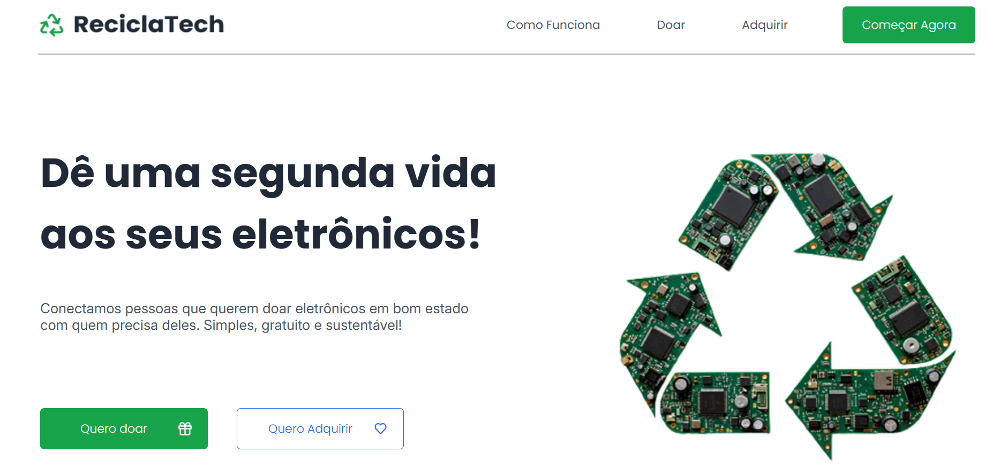

# ReciclaTech

ReciclaTech é uma plataforma que conecta doadores de eletrônicos a pessoas que precisam desses equipamentos. Nosso objetivo é dar uma segunda vida aos eletrônicos, promovendo a sustentabilidade e a inclusão digital.



## 🚀 Como Funciona

O processo é simples e direto, tanto para quem doa quanto para quem adquire.

### Para Doadores
1.  **Cadastre seu eletrônico:** Tire fotos, descreva o estado do item e publique na plataforma.
2.  **Aguarde o match:** Alguém interessado entrará em contato.
3.  **Combine a entrega:** Vocês decidem a melhor forma de realizar a entrega.

### Para Adquirentes
1.  **Explore os itens:** Navegue pelas categorias de eletrônicos disponíveis.
2.  **Demonstre interesse:** Encontrou o que precisava? Mostre seu interesse com um clique.
3.  **Receba seu novo gadget:** Combine a entrega com o doador e aproveite seu novo aparelho!

## 🛠️ Tecnologias Utilizadas

-   **HTML5**
-   **SCSS (CSS)**
-   **JavaScript**

## 💻 Como Executar

1.  Clone este repositório.
```

```

2.  Abra o arquivo `index.html` em seu navegador de preferência.

---

Feito com 💚 para um mundo melhor.
